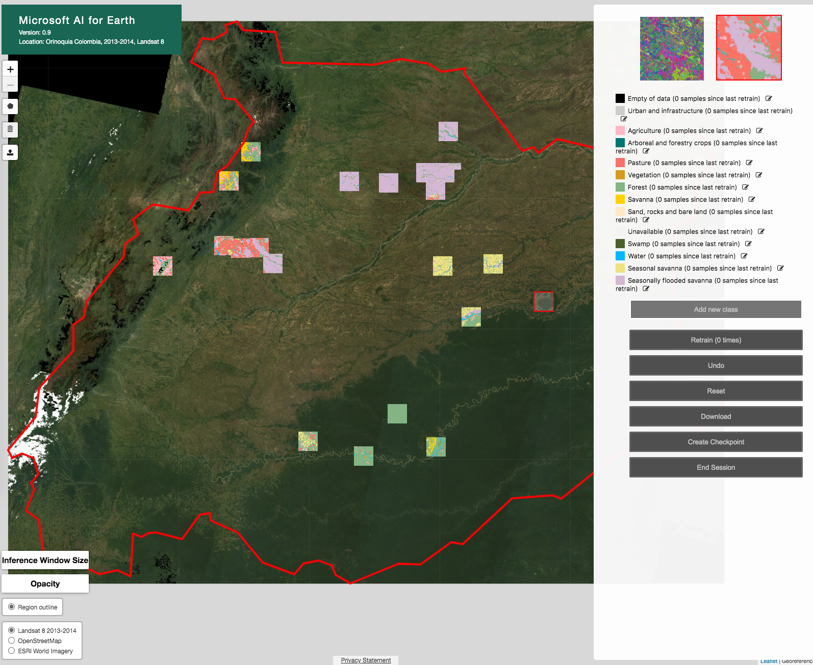

# Finetuning the land cover model interactively

Files in this folder are configurations and implementations of required classes for finetuning the model interactively in an instance of the [Land Cover Mapping tool](https://github.com/microsoft/landcover) (this repo will be referred to as the `landcover` repo below).

## Setup
Because our implementation of [ModelSession](https://github.com/microsoft/landcover/blob/master/web_tool/ModelSessionAbstract.py) relies on the experiment configuration file (a `.py` file) that produced the model, this repo needs to be on the `PYTHONPATH` when running the Land Cover Mapping tool's server, in additional to the AI for Earth utilities [repo](https://github.com/microsoft/ai4eutils):
```
export PYTHONPATH="${PYTHONPATH}:/home/boto/wcs/pycharm:/home/boto/lib/ai4eutils"
```

Note that directory names in this repo should not clash with ones in the `landcover` repo. 

Basemap needs to be in the `landcover` repo's root directory for the server to serve the data. We can create a symbolic link to the files stored in a blob storage container:
```
ln -s /home/boto/wcs/mnt/wcs-orinoquia/images_sr_median/2013_2014_dem/wcs_orinoquia_sr_median_2013_2014_dem.vrt wcs_orinoquia_sr_median_2013_2014_dem.vrt
```

The configuration files for the dataset and model in this folder and `ModelSessionOrinoquia.py` should be copied to the `landcover` repo's `web_tool` directory.

We also need to make the following changes:
- Modify [`worker.py`](https://github.com/microsoft/landcover/blob/master/worker.py) to add a case for the `model_type` `pytorch_landsat`. 
- Modify `web_tool/DataLoader.py`, changing 
    ```python
    resolution=(x_res, y_res)
    ```
    to 
    ```python
    resolution=(30, 30)  # hardcode Landsat 8 resolution
    ```

- In `web_tool/js/components.js`, modify these values in `addInferenceWindowSizeSlider` to:
    ```python
    min: 7680,
    max: 23040,
    ```
- In `web_tool/js/globals.js`, set the following variables:
    ```python
    var INFERENCE_WINDOW_SIZE = 300;
    var INFERENCE_WINDOW_SIZE = 7680;
    ```


## Operation


